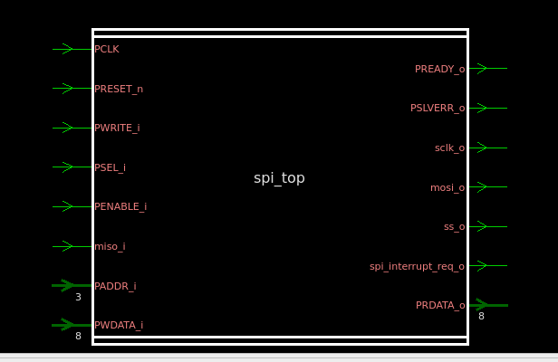
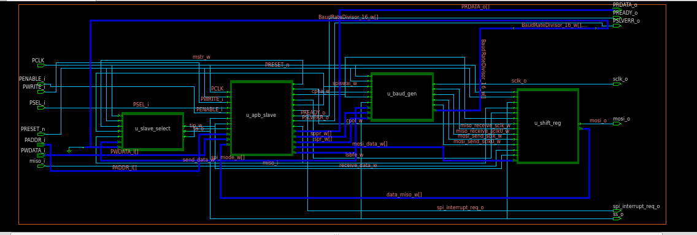

# APB-Based SPI Controller

A complete APB-based SPI Master Controller implemented in Verilog, covering the full front-end ASIC design flow — RTL coding, functional simulation in Xilinx Vivado, logic synthesis using Synopsys Design Compiler, and RTL linting using Synopsys VC Static.

---

## Table of Contents

- [Overview](#overview)
- [Block Diagram](#block-diagram)
- [Features](#features)
- [Directory Structure](#directory-structure)
- [Sub-Block Descriptions](#sub-block-descriptions)
- [APB Protocol Interface](#apb-protocol-interface)
- [SPI Protocol Modes](#spi-protocol-modes)
- [Register Map](#register-map)
- [Simulation](#simulation)
- [Synthesis](#synthesis)
- [Linting](#linting)
- [Lint Results](#lint-results)
- [Tools Used](#tools-used)

---

## Overview

This project implements a fully functional **SPI Master Controller** with an **APB (Advanced Peripheral Bus) Slave Interface**, designed as part of an AMBA-compliant SoC peripheral. The controller supports all 4 SPI modes (CPOL/CPHA), configurable baud rate, MSB/LSB-first data transfer, and generates an interrupt on transaction completion.

---

## Block Diagram

```
                        ┌─────────────────────────────────────────────┐
                        │                  spi_top                    │
                        │                                             │
  PCLK   ──────────────►│  ┌────────────┐     ┌──────────────────┐    │
  PRESET_n ────────────►│  │  u_apb_    │     │   u_baud_gen     │    │──► sclk_o
  PSEL_i   ────────────►│  │  slave     │────►│ (Baud Rate Gen)  │    │
  PENABLE_i  ──────────►│  │            │     └──────────────────┘    │
  PWRITE_i  ───────────►│  │  (APB FSM) │     ┌──────────────────┐    │──► mosi_o
  PADDR_i[2:0]  ───────►│  │            │────►│   u_shift_reg    │    │◄── miso_i
  PWDATA_i[7:0] ──────► │  └────────────┘     │ (Shift Register) │    │
                        │                     └──────────────────┘    │──► ss_o
  PRDATA_o[7:0] ◄────── │  ┌─────────────┐                            │
  PREADY_o ◄─────────── │  │ u_slave_    │                            │──► spi_interrupt_req_o
  PSLVERR_o ◄────────── │  │ select      │                            │
                        │  │ (SS + TIP)  │                            │
                        │  └─────────────┘                            │
                        └─────────────────────────────────────────────┘
```

---

## Features

- APB-compliant slave interface (AMBA 2.0)
- SPI Master with all 4 modes: Mode 0 (CPOL=0, CPHA=0), Mode 1 (CPOL=0, CPHA=1), Mode 2 (CPOL=1, CPHA=0), Mode 3 (CPOL=1, CPHA=1)
- Configurable baud rate via SPR[2:0] register
- MSB-first and LSB-first data transfer selection
- Automatic Slave Select (SS) assertion and de-assertion
- Transaction-in-progress (TIP) flag
- SPI Write Acknowledge (SPISWAI) low-power mode
- Interrupt generation on transfer completion
- Fully synthesizable RTL in Verilog
- Lint-clean: 0 Fatals, 0 Errors in Synopsys VC Static

---

## Directory Structure

```
APB-Based SPI Controller/
│
├── rtl/                             # RTL source files
│   ├── spi_top.v                    # Top-level integration module
│   ├── apb_slave.v                  # APB slave FSM + register decode
│   ├── spi_baud_generator.v         # SCLK baud rate generator
│   ├── shift_reg.v                  # SPI TX/RX shift register
│   └── spi_slave_select.v           # Slave select + TIP controller
│
├── tb/                              # Testbench files
│   ├── spi_top_tb.v                 # Top-level testbench
│   ├── apb_slave_tb.v               # APB slave testbench
│   ├── shift_reg_tb.v               # Shift register testbench
│   ├── spi_baud_generator_tb.v      # Baud generator testbench
│   └── spi_slave_select_tb.v        # Slave select testbench
│
├── sim/                             # Vivado simulation projects
│   ├── apb_slave/                   # Vivado project — apb_slave
│   ├── shift_reg/                   # Vivado project — shift_reg
│   ├── spi_top/                     # Vivado project — spi_top
│   ├── apb_slave.xpr                # Vivado project file
│   ├── shift_reg.xpr                # Vivado project file
│   ├── spi_top.xpr                  # Vivado project file
│   └── vivado.jou                   # Vivado journal log
│
├── waveforms/                       # Simulation waveform screenshots
│   ├── apb_slave_waveform.png
│   ├── shift_reg_waveform.png
│   ├── spi_baud_generator_waveform.png
│   ├── spi_slave_select_waveform.png
│   └── spi_top_waveform.png
│
├── linting_report.png               # VC Static lint summary screenshot
├── synthesis_schematic_1.png        # Synopsys DC synthesis schematic
├── synthesis_schematic_2.png        # Synopsys DC synthesis schematic (detailed)
├── .gitattributes
└── README.md
```

---

## Sub-Block Descriptions

### 1. `apb_slave.v` — APB Slave Interface

Implements the APB protocol state machine with three states: **IDLE**, **SETUP**, and **ENABLE**.
- Decodes `PADDR_i` to read/write internal SPI control registers
- Drives `PREADY_o`, `PSLVERR_o`, and `PRDATA_o`
- Issues `rd_enb` and `wr_enb` strobes to downstream blocks
- Decodes SPI_CR_1 / SPI_CR_2 / SPI_BR fields into `mstr_o`, `cpol_o`, `cpha_o`, `lsbfe_o`, `spiswai_o`, `sppr_o`, `spr_o`, `spi_mode_o`
- Generates `send_data_o` and `mosi_data_o` to hand off data to the shifter
- Generates `spi_interrupt_request_o` based on SPIF, SPTEF, and MODF status flags

**Block Diagram:**

```
                    ┌────────────────────────────┐
  PCLK     ────────►│                            │
  PRESET_n ────────►│                            ├──────► PRDATA_o[7:0]
  PADDR_i[2:0] ────►│                            ├──────► PREADY_o
  PWRITE_i ────────►│                            ├──────► PSLVERR_o
  PSEL_i ──────────►│        apb_slave           ├──────► mstr_o
  PENABLE_i ───────►│   (APB FSM: IDLE /          ├──────► cpol_o
  PWDATA_i[7:0] ───►│    SETUP / ENABLE)          ├──────► cpha_o
  ss_i ────────────►│                            ├──────► lsbfe_o
  miso_data_i[7:0]─►│   (SPI FSM: spi_run /       ├──────► spiswai_o
  receive_data_i ──►│    spi_wait / spi_stop)     ├──────► sppr_o[2:0]
  tip_i ───────────►│                            ├──────► spr_o[2:0]
                    │                            ├──────► spi_mode_o[1:0]
                    │                            ├──────► send_data_o
                    │                            ├──────► mosi_data_o[7:0]
                    │                            ├──────► spi_interrupt_request_o
                    └────────────────────────────┘
```

### 2. `spi_baud_generator.v` — Baud Rate Generator

Generates the SPI clock (`sclk_o`) and phase-shifted clocks for MOSI and MISO sampling.
- SPR[2:0] and SPPR[2:0] configure the clock divider ratio: `BaudRateDivisor = (SPPR+1) × 2^(SPR+1)`
- Produces `miso_receive_sclk_o`, `miso_receive_sclk0_o`, `mosi_send_sclk_o`, `mosi_send_sclk0_o` flags for CPOL/CPHA support
- Outputs `BaudRateDivisor_o[11:0]` for reference
- Operates in `spi_run`, `spi_wait`, and `spi_stop` modes based on `spi_mode_i` and `spiswai_i`

**Block Diagram:**

```
                    ┌────────────────────────────┐
  PCLK     ────────►│                            ├──────► sclk_o
  PRESET_n ────────►│                            ├──────► miso_receive_sclk_o
  spi_mode_i[1:0] ─►│                            ├──────► miso_receive_sclk0_o
  spiswai_i ───────►│      spi_baud_generator    ├──────► mosi_send_sclk_o
  sppr_i[2:0] ─────►│                            ├──────► mosi_send_sclk0_o
  spr_i[2:0] ──────►│                            ├──────► BaudRateDivisor_o[11:0]
  cpol_i ──────────►│                            │
  cpha_i ──────────►│                            │
  ss_i ────────────►│                            │
                    └────────────────────────────┘
```

### 3. `spi_slave_select.v` — Slave Select Controller

Controls the `ss_o` (active-low) signal and the TIP (Transaction In Progress) flag.
- Asserts `ss_o` low when `send_data_i` is high (in `spi_run` mode, or `spi_wait` mode with `spiswai_i` low)
- Uses an internal counter (`target_s = BaudRateDivisor_i × 16`) to time the SS-low duration
- De-asserts `ss_o` after the full 8-bit transfer duration has elapsed
- Asserts `receive_data_o` once the SS-low period completes, signalling the shifter/APB interface to latch MISO data
- `tip_o` is the complement of `ss_o`, indicating an active transfer to prevent APB write collisions

**Block Diagram:**

```
                    ┌────────────────────────────┐
  PCLK     ────────►│                            │
  PRESET_n ────────►│                            ├──────► ss_o
  mstr_i ──────────►│       spi_slave_select     ├──────► tip_o
  spiswai_i ───────►│   (spi_slave_control_      ├──────► receive_data_o
  spi_mode_i[1:0] ─►│    select)                 │
  send_data_i ─────►│                            │
  BaudRateDivisor_i[11:0]►│                      │
                    └────────────────────────────┘
```

### 4. `shift_reg.v` — SPI Shift Register

Handles the actual serial data transmission and reception.
- TX: shifts out `data_mosi_i[7:0]` bit by bit on `mosi_o`, MSB-first or LSB-first based on `lsbfe_i`
- RX: captures `miso_i` bit by bit into `data_miso_o[7:0]`
- Bit counters `count`, `count1`, `count2`, `count3` track TX and RX progress for each CPOL/CPHA combination
- `mosi_send_sclk_i` / `mosi_send_sclk0_i` gate when MOSI bits are driven
- `miso_receive_sclk_i` / `miso_receive_sclk0_i` gate when MISO bits are sampled

**Block Diagram:**

```
                       ┌─────────────────────────────┐
  PCLK     ───────────►│                             │
  PRESET_n ───────────►│                             │
  ss_i ────────────────►│                            ├──────► mosi_o
  send_data_i ─────────►│                            ├──────► data_miso_o[7:0]
  receive_data_i ──────►│                            │
  lsbfe_i ─────────────►│                            │
  cpha_i ──────────────►│         shift_reg          │
  cpol_i ──────────────►│       (shift_register)     │
  data_mosi_i[7:0] ────►│                            │
  miso_i ───────────────►│                           │
  miso_receive_sclk_i ──►│                           │
  miso_receive_sclk0_i ─►│                           │
  mosi_send_sclk_i ─────►│                           │
  mosi_send_sclk0_i ────►│                           │
                       └─────────────────────────────┘
```

---

## APB Protocol Interface

| Signal | Direction | Width | Description |
|--------|-----------|-------|-------------|
| PCLK | Input | 1 | APB clock |
| PRESET_n | Input | 1 | Active-low reset |
| PSEL_i | Input | 1 | Peripheral select |
| PENABLE_i | Input | 1 | Enable phase |
| PWRITE_i | Input | 1 | Write enable |
| PADDR_i | Input | 3 | Register address |
| PWDATA_i | Input | 8 | Write data |
| PRDATA_o | Output | 8 | Read data |
| PREADY_o | Output | 1 | Transfer ready |
| PSLVERR_o | Output | 1 | Slave error |

---

## SPI Protocol Modes

| Mode | CPOL | CPHA | Clock Idle | Sample Edge |
|------|------|------|------------|-------------|
| 0 | 0 | 0 | Low | Rising |
| 1 | 0 | 1 | Low | Falling |
| 2 | 1 | 0 | High | Falling |
| 3 | 1 | 1 | High | Rising |

---

## Register Map

| Address (PADDR) | Register | Description |
|-----------------|----------|-------------|
| 3'h0 | SPCR | SPI Control Register (SPE, MSTR, CPOL, CPHA, SPR[2:0]) |
| 3'h1 | SPSR | SPI Status Register (SPIF, WCOL, SPI2X) |
| 3'h2 | SPDR | SPI Data Register (TX write / RX read) |
| 3'h4 | SPER | SPI Extension Register (ICNT, ESPR[1:0]) |
| 3'h5 | SPMODE | Mode override register |

---

## Simulation

RTL simulation was performed in **Xilinx Vivado** using Verilog testbenches for each sub-block and the integrated top level.

Each testbench covers:
- Reset behaviour
- APB write and read transactions
- SPI transfer across all 4 CPOL/CPHA modes
- MSB-first and LSB-first transfers
- Baud rate configurations via SPR[2:0]
- Interrupt assertion on transfer completion

**To run simulation in Vivado:**
1. Create a new Vivado project
2. Add all files from `rtl/` and `tb/` as sources
3. Set the desired `*_tb.v` as the top simulation module
4. Run Behavioral Simulation
5. View waveforms in the Vivado waveform viewer

---

## Synthesis

Logic synthesis was performed using **Synopsys Design Compiler** targeting the `lsi_10k` library.

**Key synthesis results:**
- Top module: `spi_top`
- Technology library: `lsi_10k.db`
- All sub-blocks synthesized and elaborated cleanly
- No unresolved references or missing ports

### Top-Level Synthesized Schematic

The synthesized `spi_top` module presents a clean black-box symbol with the complete APB + SPI port list — `PCLK`, `PRESET_n`, `PWRITE_i`, `PSEL_i`, `PENABLE_i`, `PADDR_i[2:0]`, `PWDATA_i[7:0]`, and `miso_i` as inputs, and `PRDATA_o[7:0]`, `PREADY_o`, `PSLVERR_o`, `sclk_o`, `mosi_o`, `ss_o`, and `spi_interrupt_req_o` as outputs — confirming all top-level ports are correctly mapped with no missing or extra pins.



### Detailed Internal Schematic

The detailed gate-level schematic shows the four synthesized sub-blocks — `u_slave_select`, `u_apb_slave`, `u_baud_gen`, and `u_shift_reg` — and their interconnections. Key internal buses visible include `spi_mode_w`, `sppr_w`/`spr_w`, `cpol_w`/`cpha_w`/`lsbfe_w`, `mosi_data_w`, `data_miso_w`, `BaudRateDivisor_16_w`, `send_data_w`, `receive_data_w`, and `tip_w`, demonstrating clean hierarchical connectivity between the APB slave, baud rate generator, slave select, and shifter blocks after synthesis.



---

## Linting

RTL linting was performed using **Synopsys VC Static** with the `lint_rtl` goal.

**Lint run script:** `lint/apb_spi_lint.tcl`

```tcl
set_app_var enable_lint true
set_app_var enable_lint_save true
configure_lint_setup -goal lint_rtl
set search_path { ../rtl ../lib }
set_app_var link_library "../lib/lsi_10k.db"
set top spi_top
analyze -format verilog ../rtl/apb_slave.v
analyze -format verilog ../rtl/shift_reg.v
analyze -format verilog ../rtl/spi_baud_generator.v
analyze -format verilog ../rtl/spi_slave_select.v
analyze -format verilog ../rtl/spi_top.v
elaborate $top
check_lint
redirect APB_SPI_lint_report.txt { report_violations -verbose }
report_violations -verbose
checkpoint_session -session APB_SPI_session -full
```

---

## Lint Results

| Stage | Fatals | Errors | Warnings | Infos |
|-------|--------|--------|----------|-------|
| LANGUAGE_CHECK | 0 | 0 | 6 | 1 |
| STRUCTURAL_CHECK | 0 | 0 | 0 | 8 |
| **Total** | **0** | **0** | **6** | **9** |

| Tag | Severity | Count | Note |
|-----|----------|-------|------|
| STARC05-2.11.3.1 | Warning | 6 | Counters in shift_reg.v — combinational and sequential in same always block. Style violation only, functionally correct. |
| RegInputOutput-ML | Info | 8 | APB ports (PREADY_o, PRDATA_o, PSEL_i etc.) driven combinationally — correct per APB spec. |
| ReportPortInfo-ML | Info | 1 | Auto-generated port info report. |

---

## Tools Used

| Tool | Version | Purpose |
|------|---------|---------|
| Xilinx Vivado | 2023.x | RTL simulation and waveform verification |
| Synopsys Design Compiler | O-2018.06 | Logic synthesis |
| Synopsys VC Static | Latest | RTL linting |
| Verilog | IEEE 1364-2001 | RTL coding language |

---

## Author

**Virupakshayya**